






I'm First-year PhD student from [School of Biomedical Engineering](https://www.med.tsinghua.edu.cn/en/), [Tsinghua University](https://www.tsinghua.edu.cn/). My research interest includes AI for Neuroscience, Medical Image Analysis, Spiking Neural Network.

I am very fortunate to be advised by [Prof. Qiyuan Tian](https://www.med.tsinghua.edu.cn/info/1357/4249.htm) of [Birth Lab](https://birthlab.github.io/) from [School of Biomedical Engineering](https://bme.med.tsinghua.edu.cn/), Tsinghua University. 

I was previously advised by [Prof. Hong Chen](http://hongchen.ime.tsinghua.edu.cn/) from [School of Integrated Circuits](https://www.sic.tsinghua.edu.cn/en/index.htm), Tsinghua University.

You can find my CV here: [Mingxuan Liu's Curriculum Vitae](https://drive.google.com/file/d/1_AdwP3kM8S54H9hw5yXXT3xNGdMc7l6u/view?usp=sharing).

[My previous profile in Chinese](https://mp.weixin.qq.com/s/yvf6LKf-0XhFasQ4mtH-mQ).

Other related links: [Github](https://github.com/Arktis2022) / [Wechat](../images/wechat.jpg) / [Google scholar](https://scholar.google.com/citations?user=8VyGtD0AAAAJ&hl=zh-CN) / [Semantic scholar](https://www.semanticscholar.org/author/Mingxuan-Liu/2112213258).

# 🔥 News
**2024.07.25:** 🎉🎉 Awarded [the 1st prize](https://drive.google.com/file/d/17JhEwr1dtkoadzGckey5rqZ2cfRWJl_0/view?usp=sharing) at the 9th National Biomedical Engineering Innovation Design Competition for College Students.
**2024.07.20:** 🎉🎉 Our paper addressed [Sign Language Recognition](https://bmvc2024.org/programme/accepted_papers/) has been accepted by [BMVC 2024](https://bmvc2024.org/).

**2024.07.17:** 🎉🎉 Our paper addressed [Fetal Brain GMH-IVH Detection](https://arktis2022.github.io/) has been accepted by [RSNA 2024](https://www.rsna.org/annual-meeting) as oral paper presentation.

**2024.07.17:** 🎉🎉 Our paper addressed [Automated quantification of myelination in fetal brains](https://arktis2022.github.io/) has been accepted by [RSNA 2024](https://www.rsna.org/annual-meeting) as poster.

**2024.07.14:** Attended the Medical Imaging Computing Seminar 2024 ([MICS 2024](https://nidshm.xmu.edu.cn/MICS2024.html)). [Photo](https://img.erpweb.eu.org/imgs/2024/07/a4d7a1923b39dfa2.jpg)

**2024.07.04:** Attended the ADVANCED IMAGING AND MICROSCOPY (AIM 2024). [Photo](https://img.erpweb.eu.org/imgs/2024/07/05c57542c5d7591a.jpg)

**2024.07.02:** Awarded **Outstanding Graduate of Beijing** and **Outstanding Graduate of Tsinghua University (Top 2%)** !

**2024.05.10:** Attended the ISMRM-Endorsed Global Outreach Workshop in Thailand 2024. [Photo](https://img.erpweb.eu.org/imgs/2024/05/20292d7def1ae7b0.jpg)

**2024.05.07:** Attended the ISMRM 2024 held in Singapore and gave a [presentation](https://img.erpweb.eu.org/imgs/2024/05/0bf1c7f9ac829f10.jpg).

**2024.04.20:** 🎉🎉 Awarded **2024 ISMRM Magna Cum Laude Merit [Award](https://img.erpweb.eu.org/imgs/2024/06/f5785a7f202d1499.jpg) (Top 15%)**!

**2024.04.18:** 🎉🎉 Our paper addressed [Unsupervised Medical Image Anomaly Detection](https://www.techrxiv.org/doi/full/10.36227/techrxiv.24330880.v1) has been accepted by [IEEE Transactions on Instrumentation and Measurement](https://ieee-ims.org/publication/ieee-tim).

**2024.04.14:** Attended the ICASSP 2024 held in held in Seoul and posted a [poster](https://drive.google.com/file/d/1VUZIOY-K7SmnXrXcejkNnu-JccUAkZ0L/view?usp=sharing).

**2024.02.13:** 🎉🎉 Awarded **Educational Stipend Award** by 2024 ISMRM!

**2024.01.26:** 🎉🎉 Our paper addressed [Fetal MRI image quality assessment](https://www.ismrm.org/24/accepted_abstracts.pdf) has been accepted by [ISMRM 2024](https://www.ismrm.org/24m/) as oral power pitch (top 13%).

**2024.01.26:** 🎉🎉 Our paper addressed [Fetal cortex reconstruction](https://www.ismrm.org/24/accepted_abstracts.pdf) has been accepted by [ISMRM 2024](https://www.ismrm.org/24m/).

**2023.12.12:** 🎉🎉 Our paper addressed [Image deblurring](https://hplqaq.github.io/projects/sam-deblur) has been accepted by [IEEE ICASSP 2024](https://2024.ieeeicassp.org/).

**2023.11.24:** 🎉🎉 Won the top3 Prize in [Al Health Summit 2023 Poster Competition](https://mp.weixin.qq.com/s/Y7yvnuK6nqyBeBf8tAofOQ).

**2023.11.23:** Attended the AI Health Summit 2023 held in Singapore and posted a [poster](https://docs.google.com/presentation/d/1qF3I-coGVHokjrGOg2rSnimPrS6ak-8m/edit?usp=sharing&ouid=115888010982299494146&rtpof=true&sd=true). 

**2023.10.20:** 🎉🎉 Our abstract addressed [Fetal MRI image quality assessment](https://onedrive.live.com/?authkey=%21ABvG7ukadYI%2Dipw&id=A5AB43CB4B79A37A%2133213&cid=A5AB43CB4B79A37A&parId=root&parQt=sharedby&parCid=UnAuth&o=OneUp) has been accepted by [AI Health Summit 2023](https://healthsummit.ai/main/abstracts/)

**2023.10.15:** 🎉🎉 Awarded **National Scholarship** by Ministry of Education!

**2023.10.2:** Attended the [NUS-THU Joint Workshop on Biomedical Engineering 2023](https://ihealthtech.nus.edu.sg/event/nus-thu-joint-workshop-on-biomedical-engineering-2023/) hosted by the [National University of Singapore](https://nus.edu.sg/) and posted a [poster](https://drive.google.com/file/d/1XvKr1N_4eonvEOxT0u8NA1tLA0tvImT3/view). 

**2023.7.16:** Attended the [IEEE ASYNC 2023](https://c360-o2o.c360dn.com/b14b26a8836a3f6cf111018ac518dfa51920?watermark/3/image/aHR0cHM6Ly9jMzYwLW8yby5jMzYwZG4uY29tL2Y5OGQ4ODI5LTAwNjMtNDMxZi1iZmEyLTU2ZWU2Mjg5YTA2Mz9pbWFnZXMy/dissolve/100/gravity/SouthEast/dx/0/dy/0/ws/0.2071148722770726) held in Beijing, China.

**2023.5.21:** 🎉🎉 Our paper addressed [Tooth-Marked Tongue Classification](https://ieeexplore.ieee.org/abstract/document/10181870) has been accepted by [IEEE ISCAS 2023](https://2023.ieee-iscas.org/).

**2023.5.21:** 🎉🎉 Our paper addressed [Unsupervised Medical Image Anomaly Detection](https://ieeexplore.ieee.org/abstract/document/10181639) has been accepted by [IEEE ISCAS 2023](https://2023.ieee-iscas.org/).

# 📝 Publications 
#### JOURNAL PUBLICATIONS

TIM

## Anomaly Detection for Medical Images Using Teacher-Student Model with Skip Connections and Multi-scale Anomaly Consistency

**Mingxuan Liu**, Yunrui Jiao, Jingqiao Lu, Hong Chen

[IEEE Transactions on Instrumentation and Measurement](https://ieee-ims.org/publication/ieee-tim), Accept

    <a class="_blank" href="https://doi.org/10.1109/TIM.2024.3406792" >
        <i class="fas fa-newspaper" aria-hidden="true"></i> Paper
    </a>
    <a class="_blank" href="https://github.com/Arktis2022/Skip-TS">
        <i class="ai ai-open-access ai-1x" aria-hidden="true"></i> Code
    </a>

NN
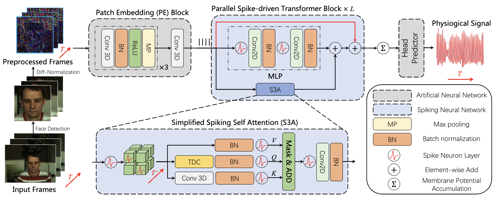

## Spiking-PhysFormer: Camera-Based Remote Photoplethysmography with Parallel Spike-driven Transformer

**Mingxuan Liu\***, Jiankai Tang\* (\*Co-first Author), Chengli Yong, Haoxiang Li, Jiahao Qi, Siwei Li, Kegang Wang, Jie Gan, Yuntao Wang, Hong Chen

[Neural Networks](https://www.sciencedirect.com/journal/neural-networks), Revise

    <a class="_blank" href="https://arxiv.org/abs/2402.04798" >
        <i class="fas fa-newspaper" aria-hidden="true"></i> Paper
    </a>

#### CONFERENCE PUBLICATIONS

BMVC 2024
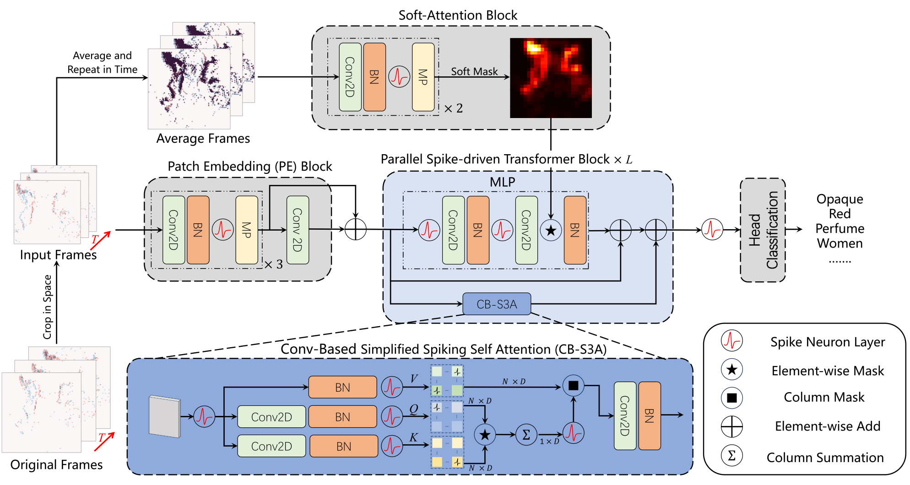

  
## Spike-SLR: An Energy-efficient Parallel Spiking Transformer for Event-based Sign Language Recognition

Xinxu Lin\*, **Mingxuan Liu\***(\*Co-first Author), Kezhuo Liu, Hong Chen

[The British Machine Vision Conference (BMVC) 2024](https://bmvc2024.org/) [Acceptance rate = 25.9%]

    <a class="_blank" href="https://hal.science/hal-04572397" >
        <i class="fas fa-newspaper" aria-hidden="true"></i> Paper
    </a>

RSNA 2024
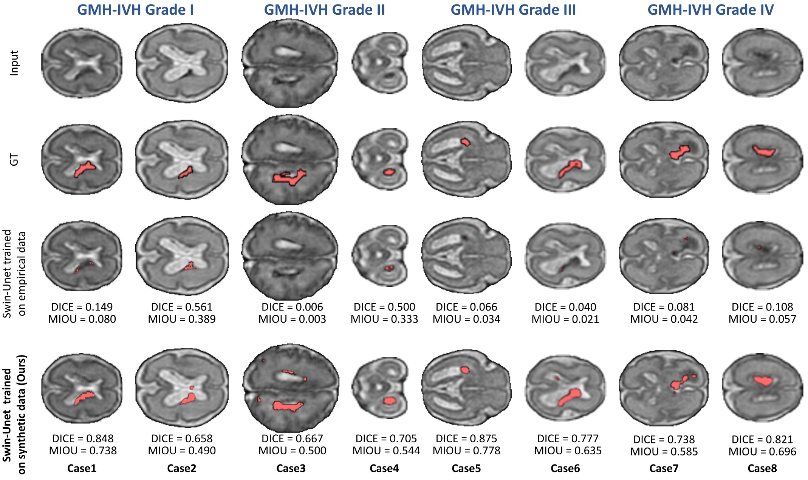

  
## Detecting Fetal Germinal Matrix and Intraventricular Hemorrhage in Brain MRI Using Label-free Deep Learning

**Mingxuan Liu**, Haoxiang Li, Juncheng Zhu, Jialan Zheng, Hongjia Yang, Zihan Li, Ziyu Li, Qiyuan Tian

[Annual Meeting of Radiological Society of North America (RSNA) 2024](https://www.rsna.org/annual-meeting) (Oral Paper Presentation)

RSNA 2024
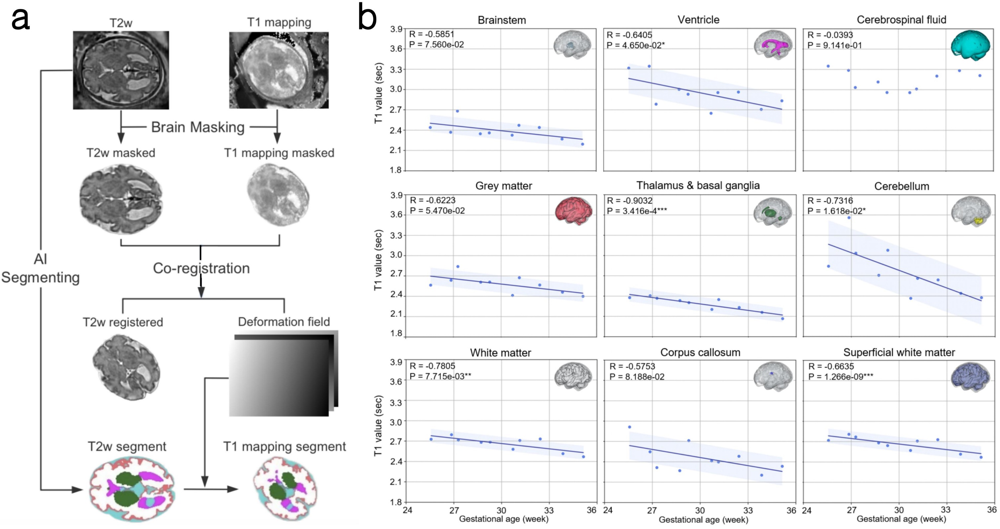

  
## Automated quantification of myelination in fetal brains

Keyu Chen, Fenglin Jia, Haoxiang Li, Jialan Zheng, **Mingxuan Liu**, Hongjia Yang, Zihan Li, Yi Liao, Haibo Qu

[Annual Meeting of Radiological Society of North America (RSNA) 2024](https://www.rsna.org/annual-meeting) (Poster Presentation)

ISMRM 2024

  
## Image Quality Assessment using an Orientation Recognition Network for Fetal MRI

**Mingxuan Liu**, Haoxiang Li, Zihan Li, Hongjia Yang, Jialan Zheng, Xiao Zhang, Qiyuan Tian

[2024 ISMRM & ISMRT Annual Meeting & Exhibition](https://www.ismrm.org/24m/) (Oral Power Pitch, Magna Cum Laude Merit Award)

    <a class="_blank" href="https://www.bilibili.com/video/BV1ow4m1e7Dk/?spm_id_from=333.788.recommend_more_video.13&vd_source=51af935938b507e665a456504af91f5b" >
        <i class="fas fa-newspaper" aria-hidden="true"></i> Video
    </a>

ISMRM 2024
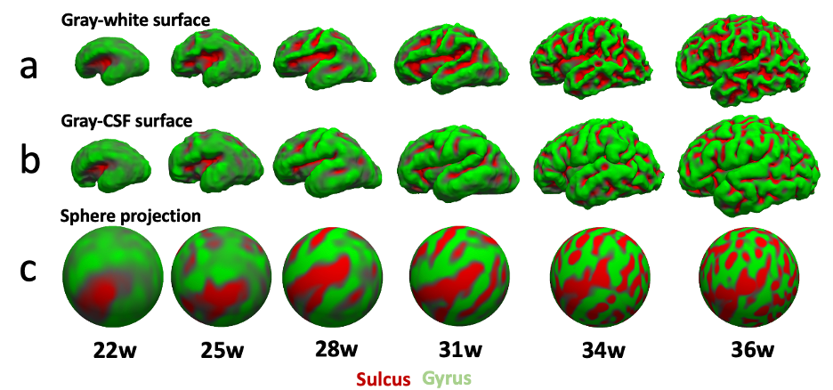

## FetalSurfer: an automated fetal cortex reconstruction method to study complex development of fetal brain using AI segmentation

Haoxiang Li, **Mingxuan Liu**, Jialan Zheng, Hongjia Yang, Zihan Li, Qiyuan Tian

[2024 ISMRM & ISMRT Annual Meeting & Exhibition](https://www.ismrm.org/24m/) (Digital Poster)

ICASSP 2024
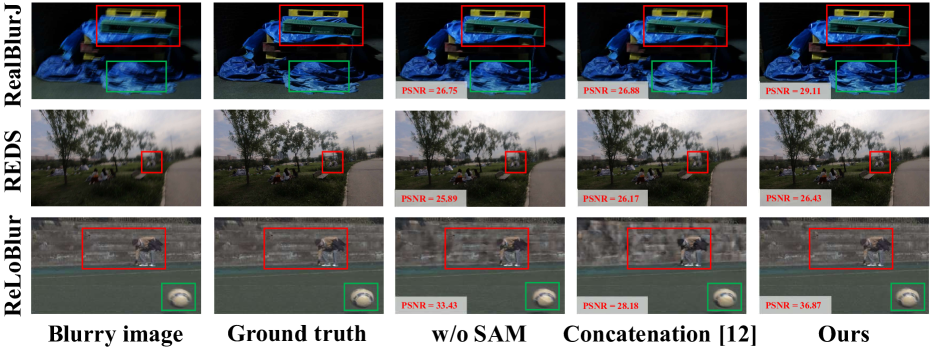

## SAM-Deblur: Let Segment Anything Boost Image Deblurring

Siwei Li\*, **Mingxuan Liu\*** (\*Co-first Author), Yating Zhang, Shu Chen, Haoxiang Li, Hong Chen, Zifei Dou

[2024 IEEE International Conference on Acoustics, Speech and Signal Processing (ICASSP)](https://2024.ieeeicassp.org/) (Poster)

    <a class="_blank" href="https://arxiv.org/abs/2309.02270" >
        <i class="fas fa-newspaper" aria-hidden="true"></i> Paper
    </a>
    <a class="_blank" href="https://hplqaq.github.io/projects/sam-deblur">
        <i class="ai ai-open-access ai-1x" aria-hidden="true"></i> Project
    </a>

AI Health Summit 2023
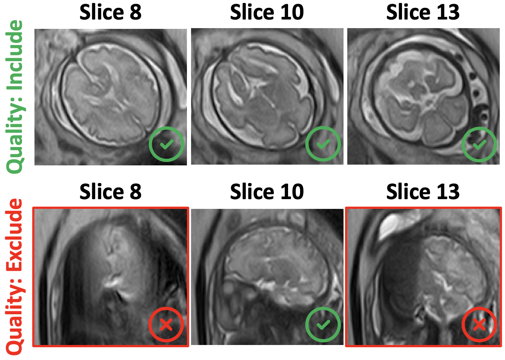

## Label-free Image Quality Assessment of Fetal Brain MRI with Unsupervised Deep Learning

**Mingxuan Liu**, Haoxiang Li, Haibo Qu, Qiyuan Tian

[AI Health Summit 2023](https://healthsummit.ai/main/abstracts/). (Top3 prize)

    <a class="_blank" href="https://onedrive.live.com/?authkey=%21ABvG7ukadYI%2Dipw&id=A5AB43CB4B79A37A%2133213&cid=A5AB43CB4B79A37A&parId=root&parQt=sharedby&parCid=UnAuth&o=OneUp" >
        <i class="fas fa-newspaper" aria-hidden="true"></i> Paper
    </a>

ISCAS 2023
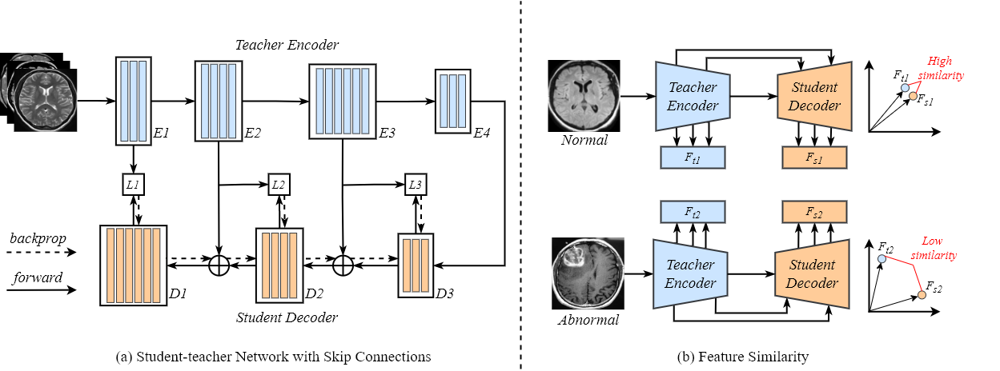

## Skip-ST: Anomaly Detection for Medical Images Using Student-Teacher Network with Skip Connections

**Mingxuan Liu**, Yunrui Jiao, Hong Chen

[2023 IEEE International Symposium on Circuits and Systems (ISCAS)](https://2023.ieee-iscas.org/) (Oral Presentation)

    <a class="_blank" href="https://ieeexplore.ieee.org/abstract/document/10181639" >
        <i class="fas fa-newspaper" aria-hidden="true"></i> Paper
    </a>
    <a class="_blank" href="https://github.com/Arktis2022/Skip-TS">
        <i class="ai ai-open-access ai-1x" aria-hidden="true"></i> Code
    </a>

ISCAS 2023
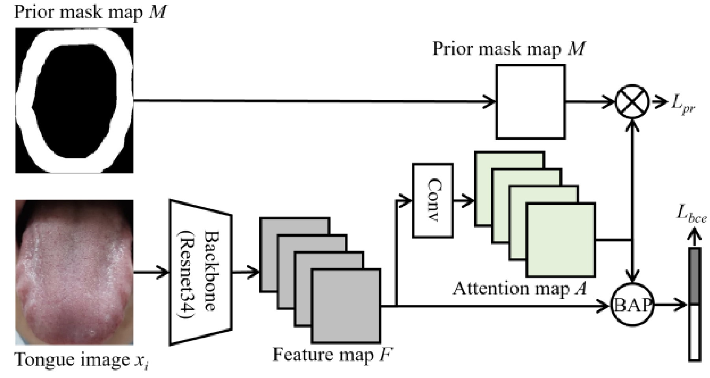

## PRTMTM: A Priori Regularization Method for Tooth-Marked Tongue Classification

Jingqiao Lu, **Mingxuan Liu**, Hong Chen

[2023 IEEE International Symposium on Circuits and Systems (ISCAS)](https://2023.ieee-iscas.org/) (Poster)

    <a class="_blank" href="https://ieeexplore.ieee.org/abstract/document/10181870" >
        <i class="fas fa-newspaper" aria-hidden="true"></i> Paper
    </a>

BioCAS 2022
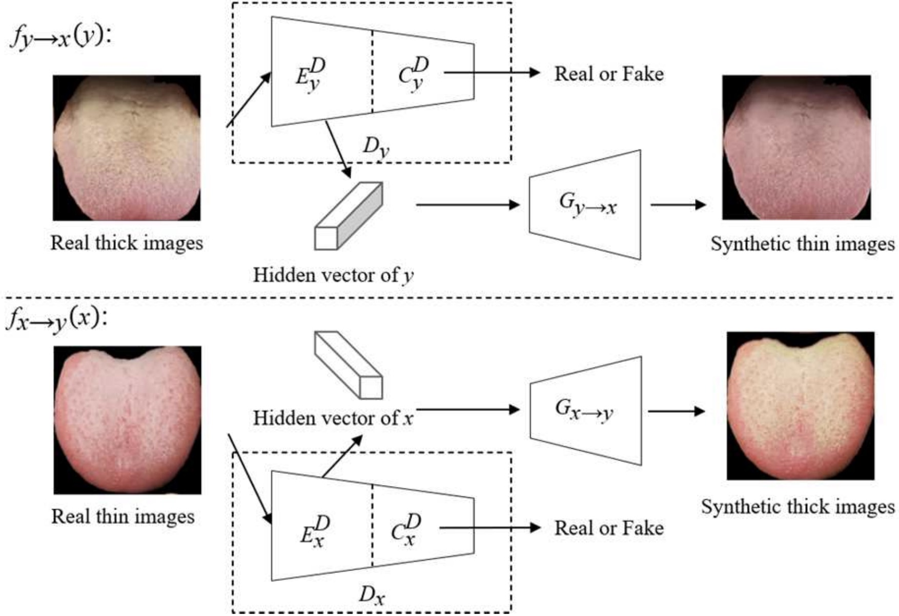

## Data Augmentation Using Image-to-image Translation for Tongue Coating Thickness Classification with Imbalanced Data

**Mingxuan Liu**, Yunrui Jiao, Hongyu Gu, Jingqiao Lu, Hong Chen

[2022 IEEE Biomedical Circuits and Systems Conference (BioCAS)](https://2022.ieee-biocas.org/site/page.aspx?pid=901&sid=1419&lang=en) (Oral Presentation)

    <a class="_blank" href="https://ieeexplore.ieee.org/abstract/document/9948645" >
        <i class="fas fa-newspaper" aria-hidden="true"></i> Paper
    </a>

#### PREPRINT PUBLICATIONS

ArXiv
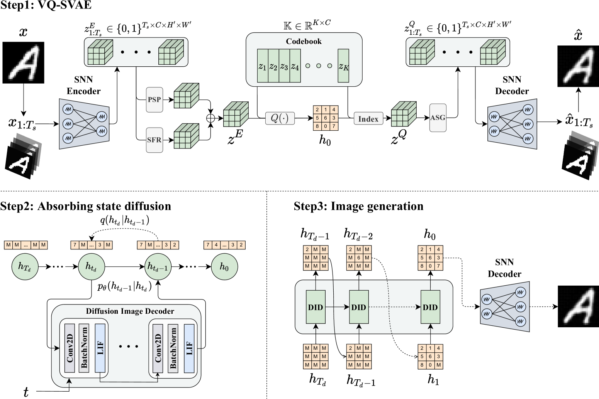

## Spiking-Diffusion: Vector Quantized Discrete Diffusion Model with Spiking Neural Networks

**Mingxuan Liu\***, Jie Gan\*, Rui Wen\* (\*Co-first Author), Tao Li, Yongli Chen, Hong Chen

    <a class="_blank" href="https://arxiv.org/abs/2308.10187" >
        <i class="fas fa-newspaper" aria-hidden="true"></i> Paper
    </a>
    <a class="_blank" href="https://github.com/Arktis2022/Spiking-Diffusion">
        <i class="ai ai-open-access ai-1x" aria-hidden="true"></i> Code
    </a>

# 🎖 Honors and Awards
- [[Certificate]](https://drive.google.com/file/d/17JhEwr1dtkoadzGckey5rqZ2cfRWJl_0/view?usp=sharing) *2024* **First Prize at 9th National Biomedical Engineering Innovation Design Competition for College Students**
- [[Certificate]](https://img.erpweb.eu.org/imgs/2024/07/6cac5893381c31d0.jpg) *2024* **Outstanding Graduate of Beijing**
- [[Certificate]](https://img.erpweb.eu.org/imgs/2024/07/b8f175077893bf72.jpg) *2024* **Outstanding Graduate Award (Top 2%)**, Tsinghua University
- [[Certificate]](https://img.erpweb.eu.org/imgs/2024/06/f5785a7f202d1499.jpg) *2024* **2024 ISMRM Magna Cum Laude Merit Award (Top 15%)**
- [[Certificate]](https://mp.weixin.qq.com/s/Oy85Q203XVaCIvwvRs9wfA) *2024* **Second Prize at the 42nd "Challenge Cup" Student Extracurricular Academic Science and Technology Works** Competition of Tsinghua University   &nbsp; &nbsp; &nbsp; *Image Deblurring System Driven by Multimodal Data Augmentation*
- [[Certificate]](https://mp.weixin.qq.com/s/Oy85Q203XVaCIvwvRs9wfA) *2024* **Third Prize at the 42nd "Challenge Cup" Student Extracurricular Academic Science and Technology Works Competition of Tsinghua University**   &nbsp; &nbsp; &nbsp; *Automated Fetal MRI Image Processing and Anomaly Detection*
- [[Certificate]](https://arktis2022.github.io/) *2024* **2024 ISMRM: Educational Stipend Award**
- [[Certificate]](https://img.erpweb.eu.org/imgs/2024/02/207b20e0e675d4fa.jpg) *2023* **Top3 Prize in [Al Health Summit 2023 Poster Competition](https://healthsummit.ai/main/abstracts/)**, Singapore
- [[Certificate]](https://img.erpweb.eu.org/imgs/2024/06/e01c9a39ab4705eb.png) *2023* **National Scholarship, Ministry of Education**, P.R. China (Top 1 in department)   &nbsp; &nbsp; &nbsp; *Top scholarship in China. 0.2% domestically*.
- [[Certificate]](https://img.erpweb.eu.org/imgs/2024/06/3725764c812767de.jpg) *2022* **Scholarship for Academic Excellence**, Tsinghua University 
- [[Certificate]](https://img.erpweb.eu.org/imgs/2024/06/fa3e12191add4d53.jpg) *2022* **Scholarship for Science and Technology Innovation Excellence**, Tsinghua University 
- [[Certificate]](https://img.erpweb.eu.org/imgs/2024/06/de4438e28228284b.jpg) *2022* **Second Prize for Outstanding Projects of the Students Research Training Program**, Tsinghua University   &nbsp; &nbsp; &nbsp; *Supported by a National College Student Innovation and Entrepreneurship Project*
- [[Certificate]](https://img.erpweb.eu.org/imgs/2024/06/8593b53040f7c593.jpg) *2020* **Scholarship for Academic Excellence**, Tsinghua University 

# 📖 Educations
- *2024.08 - present*, PhD: **School of Biomedical Engineering**, Tsinghua University, China.
- *2021.09 - 2024.06*, Undergraduate student: **School of Biomedical Engineering**, Tsinghua University, China. 
- *2019.09 – 2021.08*, Undergraduate student: **Department of Chemical Engineering**, Tsinghua University, China.

# 🎓 Academic Service
+ As one of the organizers of [OCSMRM 2024](http://www.ocsmrm.org/)
+ *Journal Reviewer*, IEEE Trans. Image Processing.
+ *Conference Reviewer*, ACM MobileHCI.
  
# 🎣 Activities
- *2024.07.20*, Attended the 9th National Biomedical Engineering Innovation Design Competition for College Students, held in Sanya. [Photo](https://img.erpweb.eu.org/imgs/2024/07/aed77c3330a9ef9c.jpg)
- *2024.07.14*, Attended the Medical Imaging Computing Seminar 2024 (MICS 2024), held in Xiamen. [Photo](https://img.erpweb.eu.org/imgs/2024/07/a4d7a1923b39dfa2.jpg)
- *2024.07.04*, Attended the ADVANCED IMAGING AND MICROSCOPY (AIM 2024), held in Huairou District. [Photo](https://img.erpweb.eu.org/imgs/2024/07/05c57542c5d7591a.jpg)
- *2024.05.10*, Attended the ISMRM-Endorsed Global Outreach Workshop in Thailand 2024. [Photo](https://img.erpweb.eu.org/imgs/2024/05/20292d7def1ae7b0.jpg)
- *2024.05.08*, Attended the OCSMRM 2024 as one of the organizers, held in Singapore. [Photo](https://img.erpweb.eu.org/imgs/2024/05/0bb68e1150ae04be.png)
- *2024.05.07*, Attended the ISMRM 2024, held in Singapore. [Photo A](https://img.erpweb.eu.org/imgs/2024/05/0bf1c7f9ac829f10.jpg) [Photo B](https://img.erpweb.eu.org/imgs/2024/05/a2646308883e4385.jpg)
- *2023.04.17*, Attended the ICASSP 2024, held in Seoul. [Photo](https://img.erpweb.eu.org/imgs/2024/04/0a91be3331527e5d.jpg)
- *2023.11.24*, Won the top3 Prize in Al Health Summit 2023 Poster Competition. [Photo](https://img.erpweb.eu.org/imgs/2024/02/207b20e0e675d4fa.jpg) (First row: Competition judges; Left one: Editor-in-chief of The Lancet Digital Health; Left two: Prof Catherine R Lucey; Left three: Editor-in-chief of Nature Medicine; Left four: Editor-in-chief of Nature Biomedical Engineering)
- *2023.11.24*, Top 5 poster competition in AI health summit 2023. [Photo](https://img.erpweb.eu.org/imgs/2024/02/2547ed7aa1423a38.jpg)
- *2023.11.22*, BIRTHLab members visited Nanyang Technological University. [Photo](https://img.erpweb.eu.org/imgs/2024/02/0cb68379b33a36d5.png)
- *2023.10.02*, Attended the NUS-THU Joint Workshop on Biomedical Engineering 2023, held in Singapore. [Photo](https://img.erpweb.eu.org/imgs/2024/02/5514cfe5a7abca58.png)
- *2023.07.26*, Attended the IEEE ASYNC 2023 held in Beijing, China. [Photo](https://img.erpweb.eu.org/imgs/2024/02/28f5198102433c57.png)
  
# 💌 Social Event
- *2024.06.28*, Graduated with a bachelor's degree from Tsinghua University. [Photo](https://img.erpweb.eu.org/imgs/2024/07/51b1f1467d9be574.jpg)
- *2024.05.02*, Visited the Tientsin Eye (天津之眼) with my girlfriend, in Tianjing. [Photo](https://img.erpweb.eu.org/imgs/2024/05/231e58636bd80878.jpg)
- *2024.03.20*, Watched the stage play "Count Wulong Mountain" (《乌龙山伯爵》) at the Happy Twist Theater (开心麻花剧场) with my girlfriend, in Beijing. [Photo](https://img.erpweb.eu.org/imgs/2024/03/f1eec2640d6e2ded.jpg)
- *2024.03.19*, Visited the Happy Valley Beijing (欢乐谷) with my girlfriend, in Beijing. [Photo A](https://img.erpweb.eu.org/imgs/2024/03/8ddc3c7236876ab4.jpg) [Photo B](https://img.erpweb.eu.org/imgs/2024/03/6302a2dab7c7ff69.jpg)
- *2024.02.28*, Visited the Juzizhou Island (橘子洲) with my girlfriend, in Changsha. [Photo](https://ibb.co/mDLzGyS)
- *2023.10.22*, Visited the National Museum of China (国家博物馆) with my girlfriend, in Beijing. [Photo](https://img.erpweb.eu.org/imgs/2024/02/b0b5af6405497e7d.png)
- *2023.06.14*, Visited the Yuewang Pavilion (岳王亭) with my girlfriend, in Changsha. [Photo](https://img.erpweb.eu.org/imgs/2024/03/b621eaab184bcea3.jpg)

# 🫶 Other
- [[Certificate]](https://img.erpweb.eu.org/imgs/2024/06/379f54cbbf11e115.jpg) *2024* **United Nations Children's Fund (unicef) Second Anniversary Commemorative Certificate**
- [[Certificate]](https://img.erpweb.eu.org/imgs/2024/06/577a0ba3ae662a03.jpg) *2023* **United Nations Children's Fund (unicef) First Anniversary Commemorative Certificate** 
# 🔗 LINKS
BIRTHLab: [The lab for Brain Imaging Research at Tsinghua](https://birthlab.github.io/) Haoxiang Li: [Department of Biomedical Engineering, Tsinghua University](https://lihaoxiang-20.github.io/) Jack Tang: [Xinya College, Tsinghua University](https://mcjacktang.github.io/) Yunkang Cao: [Huazhong University of Science and Technology](https://caoyunkang.github.io/) Xiao Zhang: [Department of Biomedical Engineering, Tsinghua University](https://xzy-xyz.github.io/) Yiming Huang: [Microsoft Research Asia](https://scholar.google.com/citations?hl=en&user=L8E-ccakgcQC) Siwei Li: [Department of Electronic Engineering of Tsinghua University](https://hplqaq.github.io/)
